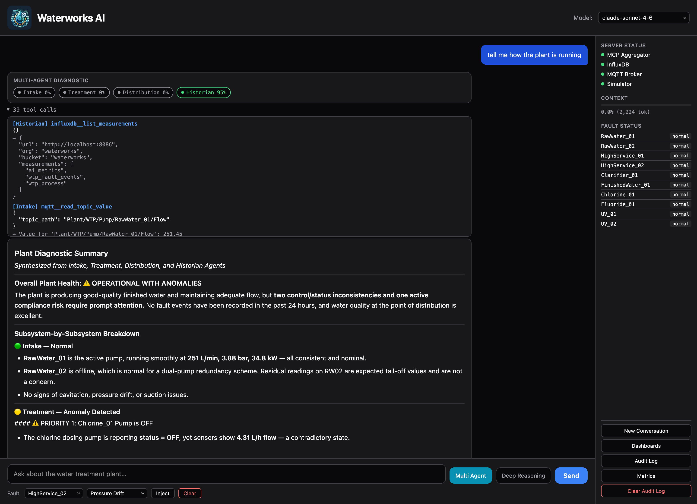
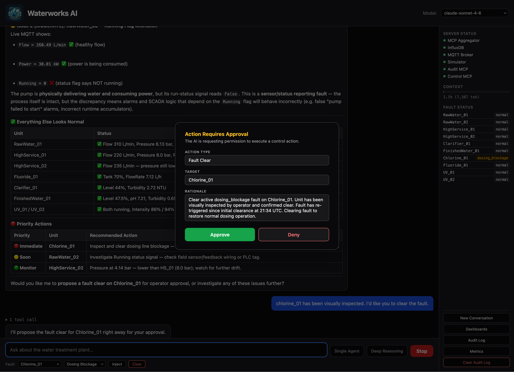

# WaterWorks AI


Open source demonstration of natural language industrial process diagnostics. A simulated water treatment plant publishes live sensor data over MQTT and OPC-UA. An AI assistant reads that data through MCP tool calls, diagnoses process conditions in plain English, proposes control actions for operator approval, and maintains a compliance-grade audit trail.

Everything in this stack is open source. No proprietary historians, SCADA platforms or cloud connectors required.

<br clear="left">

---

## Contents

- [Why this exists](#why-this-exists)
- [Screenshots](#screenshots)
- [How it works](#how-it-works)
- [Prerequisites](#prerequisites)
- [Quick start](#quick-start)
- [Windows quick start](#windows-quick-start)
- [Process units](#process-units)
- [Fault injection](#fault-injection)
- [Audit and control](#audit-and-control)
- [Demo sequence](#demo-sequence)
- [Dashboards](#dashboards)
- [Context management](#context-management)
- [Multi-agent diagnostic mode](#multi-agent-diagnostic-mode)
- [Configuration](#configuration)
- [Project layout](#project-layout)
- [Extending](#extending)

---

## Why this exists

Exploring natural language interfaces for industrial systems raises a practical problem. Most demonstrations require proprietary SCADA licenses, historian software or cloud connectors to reproduce. The architecture and reasoning patterns are interesting. The access requirements get in the way of evaluating them.

This stack uses only open source components. MQTT, OPC-UA, InfluxDB, Grafana, Python. Clone it, run it, see exactly how every layer works.

The fault injection engine makes diagnostic quality verifiable rather than claimed. Inject a known fault, ask the AI what's happening, evaluate the reasoning yourself. The AI doesn't know what was injected. It reads live sensor data, cross-references historical trends and tells you what it found.

The control layer shows what it looks like to give an AI agent write access to a process system with a human in the loop. The AI proposes an action, the operator approves or denies, and both outcomes are recorded with equal fidelity — denial is not a second-class event.

The water treatment plant is a starting point. The architecture transfers to any industrial system with MQTT or OPC-UA data sources.

---

## Screenshots

**Natural language fault diagnosis**

*Suction starvation injected on RawWater_01. The AI reads live sensor
data, queries fault history from InfluxDB, and identifies the condition
without being told where to look.*

**Plant health overview**

*Full plant health check across all process units. The AI identifies
run-status discrepancies on three pumps from a prior session.*

**Process monitoring dashboard**

*Grafana process dashboard with fault injection annotations. Red dashed
lines mark fault events across all panels simultaneously.*

**AI session observability**

*AI session telemetry alongside fault events. Tool call count and latency
spike at fault injection timestamps.*

**Interface**

*Clean interface with fault injection panel, server status indicators
and fault status panel. Deep Reasoning toggle enables extended thinking
for complex diagnostic scenarios.*

**Context management**

*Four consecutive health overview sessions. Tool selection guidance in
the system prompt cut tool calls from 34 to 1. Latency dropped from
58.8s to 21.8s. Response quality unchanged.*

**Multi-agent mode**

*Four specialist agents run in parallel, each scoped to their domain.
The orchestrator synthesizes cross-system correlations that no single
specialist could identify.*

**Operator approval**

*Agent validates a bearing wear finding on RawWater_P01 as actionable. Before executing the setpoint write, the operator is prompted to approve or deny.*

---

## How it works

```
Browser Chat UI
    │
    ▼
Claude API or Ollama
    │
    ▼
MCP Aggregator  :8100
    ├── mqtt-mcp      :8001 ──► Mosquitto MQTT broker  :1883
    ├── opcua-mcp     :8002 ──► OPC-UA server (in simulator)
    ├── influxdb-mcp  :8003 ──► InfluxDB  :8086
    ├── audit-mcp     :8004 ──► metrics.db  (session_summaries, action_events)
    └── control-mcp   :8005 ──► Simulator  :8090  (/fault, /setpoint)
                                    ▲
Simulator ──────────────────────────┤  publishes to MQTT + OPC-UA simultaneously
                                    │
MQTT → InfluxDB bridge ─────────────┘  subscribes Plant/WTP/# → writes wtp_process
  Chat backend also writes ai_metrics to InfluxDB per turn
```

The simulator runs a configurable fault injection engine. Inject a fault mid-session and ask the AI to diagnose it. It reads live values, correlates anomalies across instruments and explains what it sees. If a corrective action is warranted, it proposes one through the operator approval gate before making any change.

---

## Prerequisites

- **Docker Desktop** — runs Mosquitto, InfluxDB, and Grafana
- **Git with submodule support** — `git clone --recurse-submodules` is required
- **Python 3.11+** — all components are pure Python
- **[uv](https://docs.astral.sh/uv/)** — fast Python package manager (`brew install uv` or `pip install uv`)
- **Anthropic API key** — or a local [Ollama](https://ollama.com) installation

---

## Quick start

```bash
git clone --recurse-submodules https://github.com/smslavin/waterworks-ai
cd waterworks-ai
cp .env.example .env
# edit .env: set ANTHROPIC_API_KEY
```

Each component gets its own virtualenv. Run this once to create and populate all of them:

```bash
(cd simulator              && uv venv && uv pip install -r requirements.txt)
(cd mcp-servers/mqtt-mcp  && uv venv && uv pip install -r requirements.txt)
(cd mcp-servers/opcua-mcp && uv venv && uv pip install -r requirements.txt)
(cd influxdb-mcp           && uv venv && uv pip install -r requirements.txt)
(cd audit-mcp              && uv venv && uv pip install -r requirements.txt)
(cd control-mcp            && uv venv && uv pip install -r requirements.txt)
(cd mcp-aggregator/server  && uv venv && uv pip install -r requirements.txt)
(cd chat-ui                && uv venv && uv pip install -r requirements.txt)
(cd mqtt-influx-bridge     && uv venv && uv pip install -r requirements.txt)
```

Then open ten terminals (or a terminal multiplexer) and run each in order:

```bash
# 1 — Infrastructure
docker compose up -d

# 2 — Simulator  (MQTT + OPC-UA, fault/setpoint control on :8090)
cd simulator && .venv/bin/python simulator.py

# 3 — MQTT MCP server
cd mcp-servers/mqtt-mcp && FASTMCP_PORT=8001 .venv/bin/python server.py

# 4 — OPC-UA MCP server
cd mcp-servers/opcua-mcp && FASTMCP_PORT=8002 .venv/bin/python server.py

# 5 — InfluxDB MCP server
cd influxdb-mcp && .venv/bin/python server.py

# 6 — Audit MCP server
cd audit-mcp && .venv/bin/python server.py

# 7 — Control MCP server
cd control-mcp && .venv/bin/python server.py

# 8 — MCP Aggregator  (our backends.json, upstream server code)
cd mcp-aggregator/server && BACKENDS_FILE=../backends.json .venv/bin/python server.py

# 9 — MQTT → InfluxDB bridge
cd mqtt-influx-bridge && .venv/bin/python bridge.py

# 10 — Chat UI
cd chat-ui && .venv/bin/python backend.py
```

Open **http://localhost:8080** in a browser.

Open **dashboard.html** in a browser for an architecture overview and quick-start prompts.

---

## Windows quick start

The quick start above uses bash syntax. PowerShell equivalents follow. Clone and `.env` setup are identical.

**Create virtualenvs** — run from the repo root in PowerShell:

```powershell
foreach ($dir in @("simulator", "mcp-servers/mqtt-mcp", "mcp-servers/opcua-mcp", "influxdb-mcp", "audit-mcp", "control-mcp", "mcp-aggregator/server", "chat-ui", "mqtt-influx-bridge")) {
    Push-Location $dir; uv venv; uv pip install -r requirements.txt; Pop-Location
}
```

**Start services** — open ten PowerShell terminals and run each in order:

```powershell
# 1 — Infrastructure
docker compose up -d

# 2 — Simulator
cd simulator; .venv\Scripts\python simulator.py

# 3 — MQTT MCP server
cd mcp-servers\mqtt-mcp; $env:FASTMCP_PORT = "8001"; .venv\Scripts\python server.py

# 4 — OPC-UA MCP server
cd mcp-servers\opcua-mcp; $env:FASTMCP_PORT = "8002"; .venv\Scripts\python server.py

# 5 — InfluxDB MCP server
cd influxdb-mcp; .venv\Scripts\python server.py

# 6 — Audit MCP server
cd audit-mcp; .venv\Scripts\python server.py

# 7 — Control MCP server
cd control-mcp; .venv\Scripts\python server.py

# 8 — MCP Aggregator
cd mcp-aggregator\server; $env:BACKENDS_FILE = "..\backends.json"; .venv\Scripts\python server.py

# 9 — MQTT → InfluxDB bridge
cd mqtt-influx-bridge; .venv\Scripts\python bridge.py

# 10 — Chat UI
cd chat-ui; .venv\Scripts\python backend.py
```

The `curl` commands in the fault injection section work as-is in PowerShell 7+ and Windows 10+. If `curl` resolves to `Invoke-WebRequest` instead, use `curl.exe` explicitly.

**Running as Windows services (server deployments)**

For a Windows Server VM, use [NSSM](https://nssm.cc/download) to run each component as a Windows service instead of keeping terminals open. After creating venvs and configuring `.env`:

```powershell
# Run as Administrator
.\windows\install-services.ps1
```

This installs all nine components as auto-start Windows services with timestamped log rotation to `C:\logs\waterworks\`. Ports are pre-offset to coexist with graccess-mcp on the same host — adjust the port variables at the top of the script if running standalone.

The script shares an existing MQTT broker rather than running a second Mosquitto instance. If no broker is running, install [Mosquitto for Windows](https://mosquitto.org/download/) first — it installs as a Windows service automatically. InfluxDB and Grafana must also be installed natively (links in the script header). After the first manual start sequence (printed by the script), all services restart automatically at boot and on failure.

To remove: `.\windows\uninstall-services.ps1`

---

## Process units

The simulator models a municipal water treatment plant.

| Type | Instance | Attributes |
|---|---|---|
| Pump | RawWater_01, RawWater_02 | Flow (L/min), Pressure (bar), Power (kW), Running |
| Pump | HighService_01, HighService_02 | Flow (L/min), Pressure (bar), Power (kW), Running |
| Tank | Clarifier_01 | Level (%), Turbidity (NTU) |
| Tank | FinishedWater_01 | Level (%), pH, Turbidity (NTU) |
| Dosing | Chlorine_01, Fluoride_01 | FlowRate (L/h), Running, TankLevel (%) |
| UV | UV_01, UV_02 | Intensity (%), Running, LampHours |

MQTT topic pattern: `Plant/WTP/<Type>/<Instance>/<Attribute>`  
OPC-UA path pattern: `Objects/Plant/WTP/<Type>/<Instance>/<Attribute>`

---

## Fault injection

Faults are applied per-instance at runtime without restarting the simulator. The chat UI has an injection panel in the input area. You can also use the HTTP control plane directly:

```bash
# Inject a fault
curl -X POST "http://localhost:8090/fault?target=RawWater_01&mode=suction_starvation"

# Clear it
curl -X POST "http://localhost:8090/fault?target=RawWater_01&mode=normal"

# Check all instances
curl http://localhost:8090/status
```

Fault modes are equipment-specific. The injection panel only shows modes valid for the selected instance.

**Pump** (RawWater_01, RawWater_02, HighService_01, HighService_02)

| Mode | What it simulates |
|---|---|
| `suction_starvation` | Supply cut to a running pump. Flow ramps toward zero over ~50 s; pressure becomes erratic. Running stays True. |
| `run_status_fault` | Feedback bit stuck True while pump is actually off. Flow and Power read near zero. |
| `pressure_drift` | Transmitter calibration drift. Reported pressure diverges progressively from true value. |
| `cavitation` | Intermittent vapor formation. Flow collapses unpredictably; pressure spikes and dips rapidly. |

**Tank** (Clarifier_01, FinishedWater_01)

| Mode | What it simulates |
|---|---|
| `level_sensor_fault` | Level transmitter noise. Reported level oscillates ±20% around true value. |
| `turbidity_spike` | Contamination or filter breakthrough. Turbidity climbs to 10–14 NTU. |

**Dosing** (Chlorine_01, Fluoride_01)

| Mode | What it simulates |
|---|---|
| `dosing_blockage` | Discharge line obstruction. FlowRate ramps to zero over ~50 s. Running stays True. |
| `tank_empty` | Chemical supply exhausted. TankLevel depletes to zero over ~130 s. |
| `run_status_fault` | Feedback bit stuck True while pump is actually off. FlowRate reads near zero. |

**UV** (UV_01, UV_02)

| Mode | What it simulates |
|---|---|
| `lamp_degradation` | Progressive UV lamp aging. Intensity ramps down to ~20% over ~120 s. |
| `lamp_failure` | Sudden lamp failure. Intensity drops to near zero immediately. |

---

## Audit and control

Beyond read-only diagnostics, the stack includes a compliance-grade audit trail and an operator-gated control layer.

### Session summaries

Every completed session — single-agent and multi-agent — writes a `session_summary` record containing the user question, equipment touched, the AI's diagnosis, overall status (Normal / Anomaly Detected / Fault Detected), and a confidence score. Action events (proposals and operator decisions) are linked to the session by ID.

These records are queryable by the AI itself in subsequent sessions. Ask *"what happened yesterday at 2am?"* and it reads the audit trail to narrate the incident rather than re-reading raw sensor data.

### Audit MCP tools

`audit-mcp` exposes four tools through the aggregator:

| Tool | Purpose |
|---|---|
| `list_incidents(date, hours_back)` | Fault and anomaly sessions in a date window |
| `get_session_summary(session_id)` | Full record: diagnosis, confidence, actions, decisions |
| `query_by_equipment(equipment_id, hours_back)` | All sessions touching a specific unit |
| `query_history(start, end, equipment)` | Narrative-ready correlated records for a time range |

`query_history` returns records pre-correlated in causal order: `fault detected → diagnosis → action proposed → operator decision → outcome`. The AI receives the structure and synthesizes the narrative — it does not need additional tool calls to tell the story.

### Control actions and operator approval

`control-mcp` exposes three tools:

| Tool | Purpose |
|---|---|
| `propose_action(description, action_type, target, value)` | Request operator approval before any change |
| `set_setpoint(target, attribute, value)` | Write a new setpoint to the simulator |
| `clear_fault(target)` | Restore a unit to normal operation |

When the AI calls `propose_action`, the backend intercepts it before it reaches the MCP server. The SSE stream pauses, an approval dialog appears in the UI with the action details and rationale, and the stream blocks until the operator decides. Approval unblocks the stream and the AI proceeds with the execution tool. Denial returns a denial message to the AI, which acknowledges it and does not proceed.

Both outcomes are recorded in `action_events` with equal fidelity. *"AI proposed increasing chlorine setpoint, operator denied"* is compliance-relevant data. Denials are not second-class events.

### Setpoint ramping

Setpoint changes use a first-order lag rather than an instantaneous clamp. Each simulator tick moves the published value 10% of the remaining distance toward the target. The value approaches exponentially and snaps when within 0.01 units. This matches physical process behavior where actuators don't jump instantly to a new setpoint.

---

## Demo sequence

### Basic diagnostic demo

1. Start all services and open http://localhost:8080
2. Ask: *"Give me a health overview of the plant"* — establishes baseline
3. Inject: `RawWater_01 → suction_starvation`
4. Ask: *"There seems to be an issue. Can you tell what is happening?"*
5. Watch the AI cross-reference live values, pull historical data from InfluxDB, and diagnose without being told where the fault is
6. Open http://localhost:3000 — fault annotation visible on both dashboards
7. Clear the fault, ask the AI to confirm recovery

### Audit and control demo

1. Continue from the basic demo (or inject a new fault)
2. Ask the AI to diagnose and propose a corrective action
3. The approval dialog appears — review the rationale, approve or deny
4. If approved: the AI calls `set_setpoint` or `clear_fault`; the value ramps toward the new target
5. Ask the AI to confirm the change took effect by reading live sensor data
6. Start a new session and ask: *"What happened in the last hour?"*
7. The AI uses audit tools to narrate the incident, diagnosis, and operator decision from the session record

---

## Dashboards

Grafana is available at **http://localhost:3000** (admin / waterworks by default. Change before any network-accessible deployment).

Two dashboards are pre-provisioned:

**WTP Process Data** — plant health KPIs, flow/pressure/quality trends, fault and AI query annotations.

**AI Metrics** — covers both single-agent and multi-agent sessions.

| Panel | What it shows |
|---|---|
| Questions Answered | One count per user question in both modes |
| Avg Response Latency | End-to-end latency from the user's perspective |
| Total Tool Calls | All tool calls across all agents |
| Errors | Error count across all agents |
| Est. Cost | Model-aware: Haiku $0.80/$4, Sonnet $3/$15, Opus $15/$75 per 1M in/out tokens |
| AI Activity During Faults | Tool calls and response latency over time, with fault annotations |
| Token Usage per Turn | Per-turn tokens, labeled by agent role |
| Tool Calls per Turn | Per-turn tool calls, same role grouping |
| Specialist Latency | Latency per specialist call — shows orchestrator vs. each specialist |
| Specialist Confidence | Diagnostic confidence (0–1) per specialist per session |
| Specialist Diagnostic Status | Color-coded Normal / Anomaly / Fault strip per specialist |

The bottom three panels are only populated in multi-agent mode. Fault annotations appear on both dashboards at the same timestamps.

InfluxDB UI is at **http://localhost:8086**.

---

## Context management

The chat backend actively manages the Claude API context window across a session.

**Prompt caching** — the system prompt and tool definitions are marked with `cache_control: ephemeral`. After the first API call in a session, both are served from Anthropic's prompt cache. On multi-turn sessions with many tool calls this reduces input token cost by 80–90% and cuts time-to-first-token noticeably.

**Token budget warnings** — when context usage crosses 70% of the context window, a `[System: ...]` instruction prepends the next tool result asking the model to be concise. At 85% it instructs the model to summarize and stop calling tools. Each threshold fires once per session.

**Dynamic system prompt** — on the first turn of a new session, the backend fetches two context blocks in parallel before the first API call. Process topology is loaded from MQTT (`get_full_topic_tree`) and injected as a compact grouped running-state summary (e.g. `Pumps: Running: RawWater_01, RawWater_02 | Stopped: HighService_01`). Fault history is loaded from InfluxDB (`wtp_fault_events`, last 10 events) and appended below. Both are cached — process state for 60 seconds, fault history per session. This eliminates the first-turn tool calls that would otherwise discover plant topology, reducing latency noticeably on the opening query.

**Context pressure metric** — `context_pressure` (a 0–1 ratio of `input_tokens / CONTEXT_WINDOW_TOKENS`) is written to InfluxDB and SQLite per turn. The sidebar shows a color-coded bar: green below 70%, amber at 70–85%, red above 85%.

**Tool selection guidance** — the system prompt instructs the model to use `get_full_topic_tree()` for broad queries and `read_topic_value()` only for targeted single-attribute reads. Without this, a full plant snapshot costs 34 sequential tool calls. With it, typically 1–3.

---

## Multi-agent diagnostic mode

The chat UI has a **Single Agent / Multi Agent** toggle. In multi-agent mode a query fans out to four specialist Haiku agents running in parallel, then a Sonnet orchestrator synthesizes their findings.

```
User query
    │
    ▼
Orchestrator (Sonnet — control tools)
    │
    ├── Intake specialist       (Haiku — mqtt + influxdb)
    │     RawWater_01, RawWater_02
    │
    ├── Treatment specialist    (Haiku — mqtt + influxdb)
    │     Clarifier_01, UV_01/02, Chlorine_01, Fluoride_01
    │
    ├── Distribution specialist (Haiku — mqtt + influxdb)
    │     HighService_01/02, FinishedWater_01
    │
    └── Historian specialist    (Haiku — influxdb only)
          All units, historical trends only
```

All four specialists run simultaneously via `asyncio.gather()`. Each is scoped to the tool subset relevant to its process area. The orchestrator synthesizes the four findings and, if a clear fault is detected, may propose a control action using the same operator approval flow as single-agent mode.

The UI shows a chip for each specialist. Chips update in real time as events arrive and transition to a color-coded status (Normal / Anomaly Detected / Fault Detected) with a confidence score when each specialist completes.

Multi-agent mode requires a Claude API key. It is incompatible with the Deep Reasoning toggle.

---

## Configuration

All configuration lives in `.env`. Copy `.env.example` to get started. The defaults work for a local run without changes except for `ANTHROPIC_API_KEY`.

| Variable | Default | Purpose |
|---|---|---|
| `ANTHROPIC_API_KEY` | _(empty)_ | Required for Claude models |
| `OLLAMA_URL` | `http://127.0.0.1:11434` | Ollama base URL |
| `INFLUXDB_TOKEN` | `waterworks-dev-token` | Set once at first `docker compose up` |
| `INFLUXDB_ORG` | `waterworks` | InfluxDB organisation |
| `INFLUXDB_BUCKET` | `waterworks` | Default bucket for all data |
| `PUBLISH_INTERVAL` | `2.0` | Simulator tick rate in seconds |
| `OPCUA_PORT` | `4840` | OPC-UA server port |
| `CONTROL_PORT` | `8090` | Simulator fault/setpoint control HTTP port |
| `CONTEXT_WINDOW_TOKENS` | `200000` | Context window size for budget warnings |

> **Note:** `INFLUXDB_TOKEN` and the other `DOCKER_INFLUXDB_INIT_*` values are only used on a fresh volume. After the first `docker compose up` they are baked in. Reset with `docker compose down -v`.

---

## Project layout

```
waterworks-ai/
├── simulator/              Dual MQTT+OPC-UA WTP simulator with fault injection
│   ├── simulator.py        Entrypoint — asyncio loop, paho MQTT, asyncua, HTTP control plane
│   ├── generators.py       RandomWalk and OscillatingBool value generators
│   ├── faults.py           FaultMode enum and per-instance fault state machine
│   └── instances.py        WTP instance registry
├── influxdb-mcp/           FastMCP server :8003 — write_point, query, list_measurements
├── audit-mcp/              FastMCP server :8004 — session/action history query tools
├── control-mcp/            FastMCP server :8005 — propose_action, set_setpoint, clear_fault
├── chat-ui/                Starlette/SSE backend and vanilla JS frontend
│   ├── backend.py          Routes: /api/chat, /api/health, /api/fault, /api/action/respond
│   ├── claude_loop.py      Claude API streaming loop — MCP tools, propose_action intercept
│   ├── multi_agent_loop.py Fan-out to 4 specialist agents + orchestrator with control tools
│   ├── openai_loop.py      OpenAI-compatible loop for Ollama
│   ├── mcp_client.py       MCP aggregator client (per-url tool cache, list/call tools)
│   ├── session_store.py    session_summaries + action_events tables in metrics.db
│   ├── control.py          asyncio Future registry for the operator approval flow
│   ├── metrics.py          ai_metrics → InfluxDB + SQLite per turn
│   ├── audit.py            JSONL audit log (tool calls, responses, errors)
│   ├── providers.json      LLM provider and model configuration
│   └── static/             index.html + app.js (no framework, no bundler)
├── mqtt-influx-bridge/     Subscribes Plant/WTP/# → writes wtp_process to InfluxDB
├── mcp-servers/            Git submodule — mqtt-mcp (:8001) and opcua-mcp (:8002)
├── mcp-aggregator/
│   ├── server/             Git submodule — aggregator server code (:8100)
│   └── backends.json       Waterworks endpoint config (BACKENDS_FILE=../backends.json)
├── docker/
│   ├── mosquitto/          mosquitto.conf (anonymous, persistence on)
│   └── grafana/            Provisioned InfluxDB datasource and dashboards
├── docker-compose.yml      Mosquitto + InfluxDB 2.7 + Grafana (named volumes)
└── .env.example            All environment variables with defaults
```

---

## Extending

**Add a new process unit:** edit `simulator/instances.py` — add an entry to `INSTANCES`. It appears in both MQTT and OPC-UA automatically.

**Add a new fault mode:** add a member to `FaultMode` in `simulator/faults.py` and a corresponding `_method` in `FaultState`. The HTTP control plane picks it up with no other changes.

**Add an MCP server:** add an entry to `mcp-aggregator/backends.json`. The aggregator discovers and prefixes its tools at startup. Use the management API (`POST /backends`) to add backends at runtime without a restart.

**Add a Grafana dashboard:** drop a JSON dashboard file into `docker/grafana/provisioning/dashboards/` and add a dashboards provisioning YAML alongside it.
