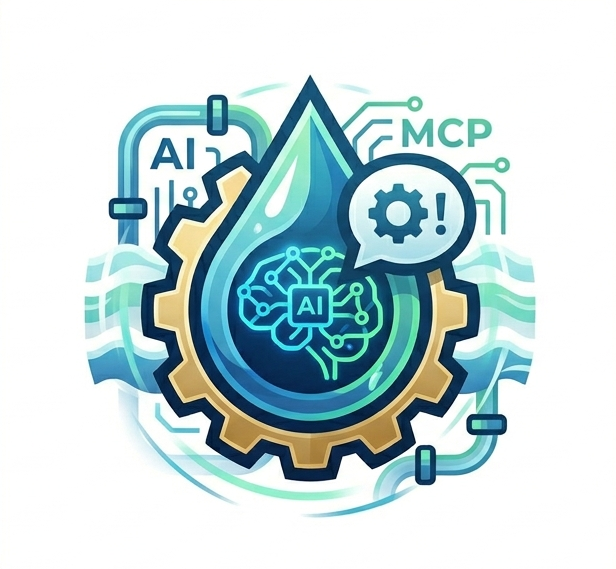
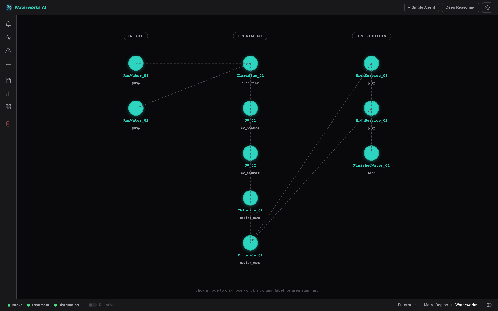
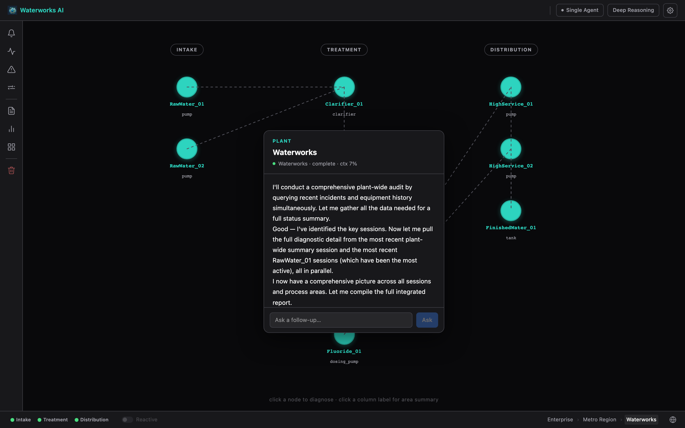
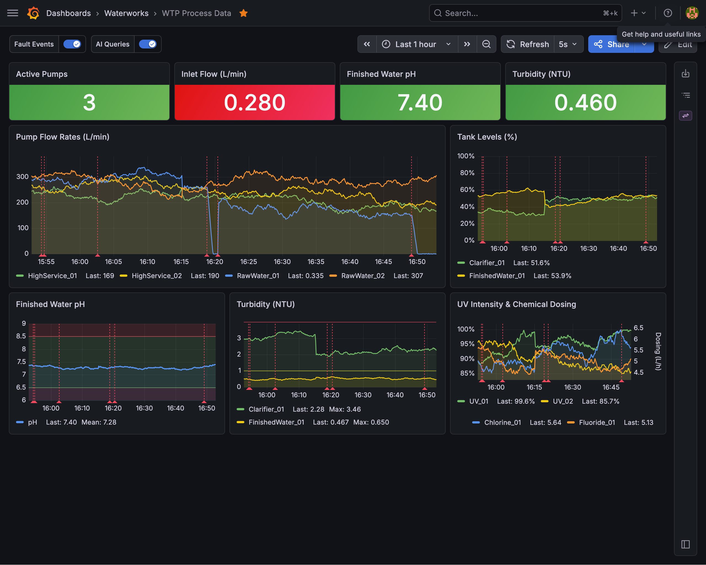
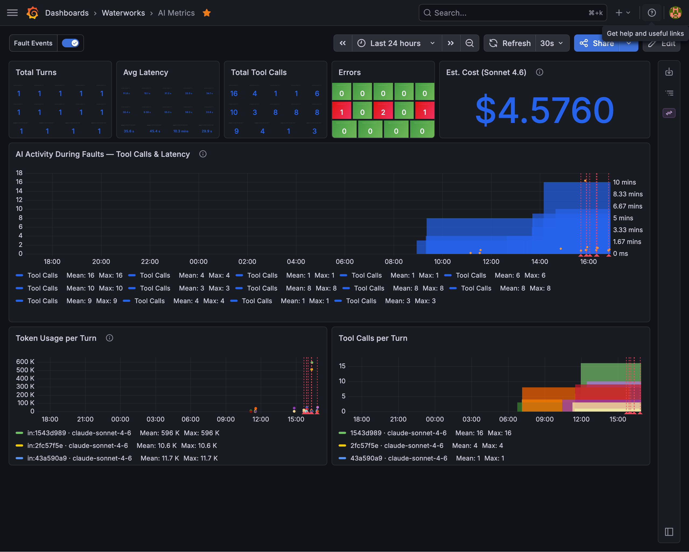
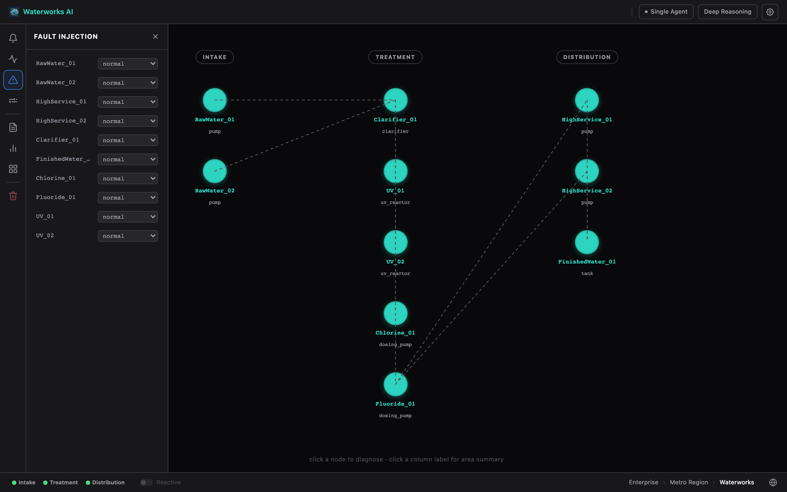
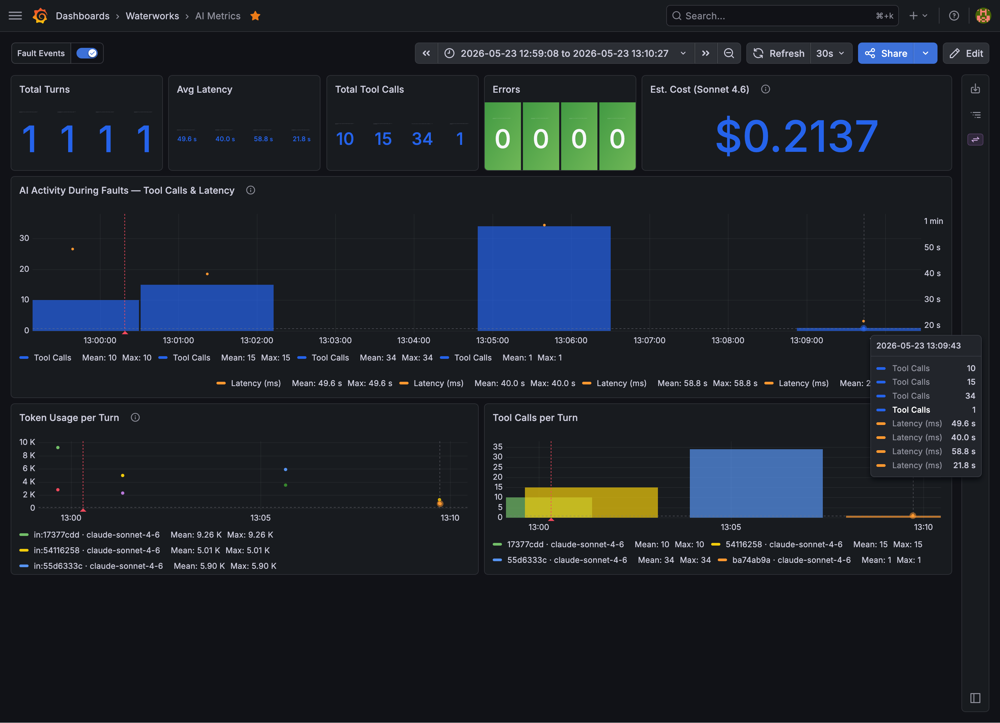

# waterworks-ai

Open source demonstration of natural language industrial process diagnostics. A simulated water treatment plant publishes live sensor data over MQTT and OPC-UA. An AI assistant reads that data through MCP tool calls and diagnoses process conditions in plain English.

Everything in this stack is open source. No proprietary historians, SCADA platforms or cloud connectors required.

---

## Why this exists

Exploring natural language interfaces for industrial systems raises a practical problem. Most demonstrations require proprietary SCADA licenses, historian software or cloud connectors to reproduce. The architecture and reasoning patterns are interesting. The access requirements get in the way of evaluating them.

This stack uses only open source components. MQTT, OPC-UA, InfluxDB, Grafana, Python. Clone it, run it, see exactly how every layer works.

The fault injection engine makes diagnostic quality verifiable rather than claimed. Inject a known fault, ask the AI what's happening, evaluate the reasoning yourself. The AI doesn't know what was injected. It reads live sensor data, cross-references historical trends and tells you what it found. The Grafana dashboards show AI session behavior alongside process data. Tool calls, latency and token usage alongside the sensor readings the model was reasoning about.

The water treatment plant is a starting point. The architecture transfers to any industrial system with MQTT or OPC-UA data sources.

---

## Screenshots

**Natural language fault diagnosis**

*Suction starvation injected on RawWater_01. The AI reads live sensor 
data, queries fault history from InfluxDB, and identifies the condition 
without being told where to look. Fault history shows the condition 
occurred twice. The AI notes the root cause may not have been 
fully resolved the first time.*

**Plant health overview**

*Full plant health check across all process units. The AI identifies 
run-status discrepancies on three pumps from a prior session. Pumps reporting stopped while delivering flow, pressure, and power.*

**Process monitoring dashboard**

*Grafana process dashboard with fault injection annotations. Red dashed 
lines mark fault events across all panels simultaneously. Inlet flow KPI 
in red. The flow drop is visible in the pump flow rates trend.*

**AI session observability**

*AI session telemetry alongside fault events. Tool call count and latency 
spike at fault injection timestamps. The AI working harder during fault 
conditions is visible in the data. Estimated session cost: $4.58.*

**Interface**

*Clean interface with fault injection panel, server status indicators 
and fault status panel. Deep Reasoning toggle enables extended thinking 
for complex diagnostic scenarios.*

**Context management**

*Four consecutive health overview sessions. Tool calls per turn: 10, 15, 34, 1. The final session reflects context management in place. Plant topology injected at session start, tool selection guidance in the system prompt. Latency dropped from 58.8s to 21.8s. Response quality unchanged.*

---

## How it works

```
Browser Chat UI
    │
    ▼
Claude API or Ollama
    │
    ▼
MCP Aggregator  :8100
    ├── mqtt-mcp      :8001 ──► Mosquitto MQTT broker  :1883
    ├── opcua-mcp     :8002 ──► OPC-UA server (in simulator)
    └── influxdb-mcp  :8003 ──► InfluxDB  :8086
                                    ▲
Simulator ──────────────────────────┤  publishes to MQTT + OPC-UA simultaneously
                                    │
MQTT → InfluxDB bridge ─────────────┘  subscribes Plant/WTP/# → writes wtp_process
  Chat backend also writes AI_Metrics to InfluxDB per turn
```

The simulator runs a configurable fault injection engine. Inject a fault mid-session and ask the AI to diagnose it. It reads live values, correlates anomalies across instruments and explains what it sees.

---

## Prerequisites

- **Docker Desktop** — runs Mosquitto, InfluxDB, and Grafana
- **Git with submodule support** — git clone --recurse-submodules is required
- **Python 3.11+** — all components are pure Python
- **[uv](https://docs.astral.sh/uv/)** — fast Python package manager (`brew install uv` or `pip install uv`)
- **Anthropic API key** — or a local [Ollama](https://ollama.com) installation

---

## Quick start

```bash
git clone --recurse-submodules https://github.com/smslavin/waterworks-ai
cd waterworks-ai
cp .env.example .env
# edit .env: set ANTHROPIC_API_KEY
```

Each component gets its own virtualenv. Run this once to create and populate all of them:

```bash
(cd simulator              && uv venv && uv pip install -r requirements.txt)
(cd mcp-servers/mqtt-mcp  && uv venv && uv pip install -r requirements.txt)
(cd mcp-servers/opcua-mcp && uv venv && uv pip install -r requirements.txt)
(cd influxdb-mcp           && uv venv && uv pip install -r requirements.txt)
(cd mcp-aggregator/server  && uv venv && uv pip install -r requirements.txt)
(cd chat-ui                && uv venv && uv pip install -r requirements.txt)
(cd mqtt-influx-bridge     && uv venv && uv pip install -r requirements.txt)
```

Then open eight terminals (or a terminal multiplexer) and run each in order:

```bash
# 1 — Infrastructure
docker compose up -d

# 2 — Simulator  (MQTT + OPC-UA, fault control on :8090)
cd simulator && .venv/bin/python simulator.py

# 3 — MQTT MCP server
cd mcp-servers/mqtt-mcp && FASTMCP_PORT=8001 .venv/bin/python server.py

# 4 — OPC-UA MCP server
cd mcp-servers/opcua-mcp && FASTMCP_PORT=8002 .venv/bin/python server.py

# 5 — InfluxDB MCP server
cd influxdb-mcp && .venv/bin/python server.py

# 6 — MCP Aggregator  (our backends.json, upstream server code)
cd mcp-aggregator/server && BACKENDS_FILE=../backends.json .venv/bin/python server.py

# 7 — MQTT → InfluxDB bridge  (writes process data to InfluxDB for historical queries)
cd mqtt-influx-bridge && .venv/bin/python bridge.py

# 8 — Chat UI
cd chat-ui && .venv/bin/python backend.py
```

Open **http://localhost:8080** in a browser.

---

## Process units

The simulator models a municipal water treatment plant.

| Type | Instance | Attributes |
|---|---|---|
| Pump | RawWater_01, RawWater_02 | Flow (L/min), Pressure (bar), Power (kW), Running |
| Pump | HighService_01, HighService_02 | Flow (L/min), Pressure (bar), Power (kW), Running |
| Tank | Clarifier_01 | Level (%), Turbidity (NTU) |
| Tank | FinishedWater_01 | Level (%), pH, Turbidity (NTU) |
| Dosing | Chlorine_01, Fluoride_01 | FlowRate (L/h), Running, TankLevel (%) |
| UV | UV_01, UV_02 | Intensity (%), Running, LampHours |

MQTT topic pattern: `Plant/WTP/<Type>/<Instance>/<Attribute>`  
OPC-UA path pattern: `Objects/Plant/WTP/<Type>/<Instance>/<Attribute>`

---

## Fault injection

Faults are applied per-instance at runtime without restarting the simulator. The chat UI has an injection panel in the input area. You can also use the HTTP control plane directly:

```bash
# Inject a fault
curl -X POST "http://localhost:8090/fault?target=RawWater_01&mode=suction_starvation"

# Clear it
curl -X POST "http://localhost:8090/fault?target=RawWater_01&mode=normal"

# Check all instances
curl http://localhost:8090/status
```

Fault modes are equipment-specific. The injection panel only shows modes valid for the selected instance.

**Pump** (RawWater_01, RawWater_02, HighService_01, HighService_02)

| Mode | What it simulates |
|---|---|
| `suction_starvation` | Supply cut to a running pump. Flow ramps toward zero over ~50 s; pressure becomes erratic. Running stays True. |
| `run_status_fault` | Feedback bit stuck True while pump is actually off. Flow and Power read near zero. |
| `pressure_drift` | Transmitter calibration drift. Reported pressure diverges progressively from true value. |
| `cavitation` | Intermittent vapor formation. Flow collapses unpredictably; pressure spikes and dips rapidly. |

**Tank** (Clarifier_01, FinishedWater_01)

| Mode | What it simulates |
|---|---|
| `level_sensor_fault` | Level transmitter noise. Reported level oscillates ±20% around true value. |
| `turbidity_spike` | Contamination or filter breakthrough. Turbidity climbs to 10–14 NTU. |

**Dosing** (Chlorine_01, Fluoride_01)

| Mode | What it simulates |
|---|---|
| `dosing_blockage` | Discharge line obstruction. FlowRate ramps to zero over ~50 s. Running stays True. |
| `tank_empty` | Chemical supply exhausted. TankLevel depletes to zero over ~130 s. |
| `run_status_fault` | Feedback bit stuck True while pump is actually off. FlowRate reads near zero. |

**UV** (UV_01, UV_02)

| Mode | What it simulates |
|---|---|
| `lamp_degradation` | Progressive UV lamp aging. Intensity ramps down to ~20% over ~120 s. |
| `lamp_failure` | Sudden lamp failure. Intensity drops to near zero immediately. |

---

## Demo sequence

1. Start all services and open http://localhost:8080
2. Ask: *"Give me a health overview of the plant"* — establishes baseline
3. Inject: `RawWater_01 → suction_starvation`
4. Ask: *"There seems to be an issue. Can you tell what is happening?"*
5. Watch the AI cross-reference live values, pull historical data 
   from InfluxDB, and diagnose without being told where the fault is
6. Click the Dashboards button in the chat UI or open http://localhost:3000 directly, fault annotation visible on both process and AI metrics dashboards
7. Clear the fault, ask the AI to confirm recovery

---

## Dashboards

Grafana is available at **http://localhost:3000** (admin / waterworks by default. Change before any network-accessible deployment). 

Two dashboards are pre-provisioned:
- **WTP Process Data** — plant health KPIs, flow/pressure/quality trends, 
  fault and AI query annotations
- **AI Metrics** — token usage, latency, tool calls, estimated cost per session. 
  Fault annotations on both dashboards share the same timestamp — 
  the AI working harder during faults is visible in the data.

The chat UI includes a **Dashboards** button that opens Grafana directly 
without requiring login. Both are available immediately after `docker compose up`.

The InfluxDB datasource is pre-provisioned. AI_Metrics are written to the `ai_metrics` measurement with `model` and `session_id` tags — fields include `input_tokens`, `output_tokens`, `tool_call_count`, `latency_ms`, `context_pressure`, `error_count`, `latency_ms`.

InfluxDB UI is at **http://localhost:8086**.

---

## Context management

The chat backend actively manages the Claude API context window across a session. Several mechanisms work together:

**Prompt caching**  
The system prompt and tool definitions are marked with `cache_control: ephemeral`. After the first API call in a session, both are served from Anthropic's prompt cache rather than re-tokenized. On multi-turn sessions with many tool calls this reduces input token cost by 80–90% and cuts time-to-first-token noticeably.

**Token budget warnings**  
The backend tracks `input_tokens` returned by each API call. When context usage crosses 70% of the context window, a `[System: ...]` instruction is prepended to the next tool result message asking the model to be concise and avoid unnecessary tool calls. At 85% it instructs the model to summarize findings and stop calling tools. The thresholds are one-shot per session — the warning fires once at each level and is not repeated.

Both thresholds use the same `CONTEXT_WINDOW_TOKENS` value as the denominator. Override it via env var if you want earlier warnings in a constrained environment.

**Fault history injection**  
On the first turn of a new session, the backend queries InfluxDB for the 10 most recent `wtp_fault_events` and appends them to the system prompt. This gives the AI awareness of prior fault patterns without telling it the current fault state — the AI still has to discover what is wrong by reading live sensor data. The injection happens only on session start so it doesn't repeat or accumulate.

**Context pressure metric**  
`context_pressure` (a 0–1 ratio of `input_tokens / CONTEXT_WINDOW_TOKENS`) is written to InfluxDB and SQLite per turn alongside the other AI_Metrics. The sidebar in the chat UI shows a colour-coded bar: green below 70%, amber at 70–85%, red above 85%.

**Tool selection guidance**  
The system prompt instructs the model to use `get_full_topic_tree()` for broad queries like plant health overviews, and `read_topic_value()` only for targeted single-attribute reads. Without this guidance the model calls `read_topic_value` once per attribute — 34 sequential calls for a full plant snapshot. With it, a health overview typically completes in 1–3 tool calls.

---

## Configuration

All configuration lives in `.env`. Copy `.env.example` to get started. The defaults work for a local run without changes except for `ANTHROPIC_API_KEY`.

| Variable | Default | Purpose |
|---|---|---|
| `ANTHROPIC_API_KEY` | _(empty)_ | Required for Claude models |
| `OLLAMA_URL` | `http://127.0.0.1:11434` | Ollama base URL |
| `INFLUXDB_TOKEN` | `waterworks-dev-token` | Set once at first `docker compose up` |
| `INFLUXDB_ORG` | `waterworks` | InfluxDB organisation |
| `INFLUXDB_BUCKET` | `waterworks` | Default bucket for all data |
| `PUBLISH_INTERVAL` | `2.0` | Simulator tick rate in seconds |
| `OPCUA_PORT` | `4840` | OPC-UA server port |
| `CONTROL_PORT` | `8090` | Simulator fault control HTTP port |
| `CONTEXT_WINDOW_TOKENS` | `200000` | Context window size for budget warnings — override for smaller demo environments |

> **Note:** `INFLUXDB_TOKEN` and the other `DOCKER_INFLUXDB_INIT_*` values are only used on a fresh volume. After the first `docker compose up` they are baked in. Reset with `docker compose down -v`.

---

## Project layout

```
waterworks-ai/
├── simulator/              Dual MQTT+OPC-UA WTP simulator with fault injection
│   ├── simulator.py        Entrypoint — asyncio event loop, paho MQTT, asyncua
│   ├── generators.py       RandomWalk and OscillatingBool value generators
│   ├── faults.py           FaultMode enum and per-instance fault state machine
│   └── instances.py        WTP instance registry
├── influxdb-mcp/           FastMCP server: write_point, query, list_measurements
├── chat-ui/                Starlette/SSE backend and vanilla JS frontend
│   ├── backend.py          Routes: /api/chat, /api/models, /api/health, /api/fault
│   ├── claude_loop.py      Claude API streaming loop with MCP tool calling
│   ├── openai_loop.py      OpenAI-compatible loop for Ollama
│   ├── mcp_client.py       MCP aggregator client (list tools, call tools)
│   ├── metrics.py          AI_Metrics → InfluxDB per turn
│   ├── audit.py            JSONL audit log
│   ├── providers.json      LLM provider and model configuration
│   └── static/             index.html + app.js (no framework, no bundler)
├── mqtt-influx-bridge/     Subscribes Plant/WTP/# → writes wtp_process to InfluxDB
│   └── bridge.py           Paho subscriber + batched InfluxDB write
├── mcp-servers/            Git submodule — mqtt-mcp (:8001) and opcua-mcp (:8002)
├── mcp-aggregator/
│   ├── server/             Git submodule — aggregator server code (:8100)
│   └── backends.json       Waterworks endpoint config (BACKENDS_FILE=../backends.json)
├── docker/
│   ├── mosquitto/          mosquitto.conf (anonymous, persistence on)
│   └── grafana/            Provisioned InfluxDB datasource
├── docker-compose.yml      Mosquitto + InfluxDB 2.7 + Grafana (named volumes)
└── .env.example            All environment variables with defaults
```

---

## Extending

**Add a new process unit:** edit `simulator/instances.py` — add an entry to `INSTANCES`. It appears in both MQTT and OPC-UA automatically.

**Add a new fault mode:** add a member to `FaultMode` in `simulator/faults.py` and a corresponding `_method` in `FaultState`. The HTTP control plane picks it up with no other changes.

**Add an MCP server:** add an entry to `mcp-aggregator/backends.json`. The aggregator discovers and prefixes its tools at startup.

**Add a Grafana dashboard:** drop a JSON dashboard file into `docker/grafana/provisioning/dashboards/` and add a dashboards provisioning YAML alongside it.
