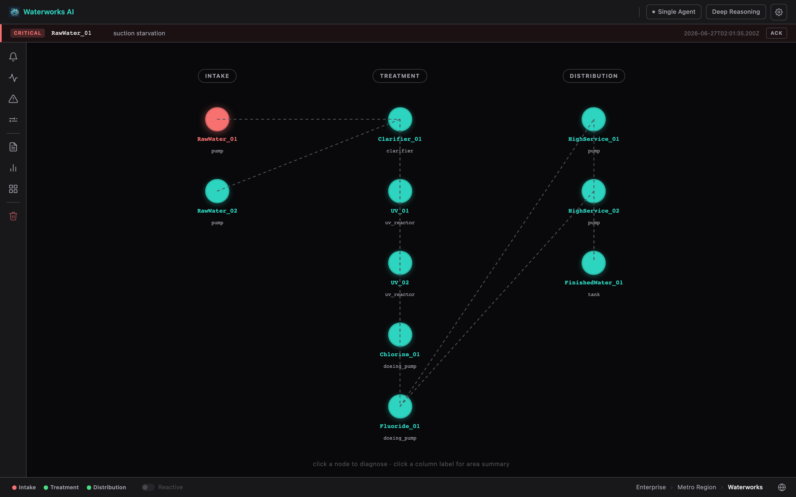
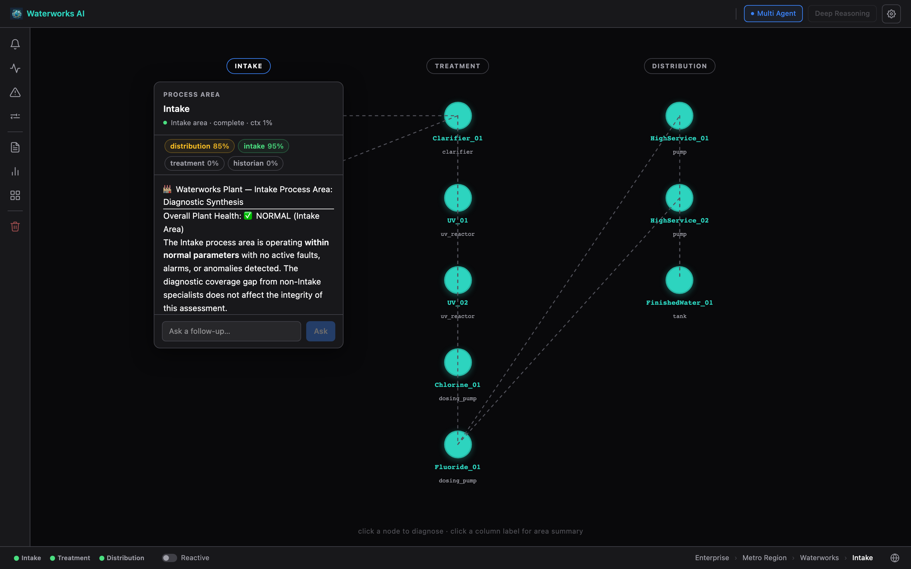
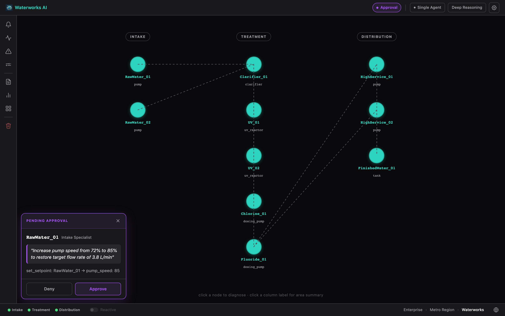

# WaterWorks AI

[](https://github.com/smslavin/waterworks-ai/actions/workflows/test.yml)


Open source demonstration of natural language industrial process diagnostics. A simulated water treatment plant publishes live sensor data over MQTT and OPC-UA. An AI assistant reads that data through MCP tool calls, diagnoses process conditions in plain English, proposes control actions for operator approval, and maintains a compliance-grade audit trail.

Everything in this stack is open source. No proprietary historians, SCADA platforms or cloud connectors required.

<br clear="left">

---

## Contents

- [Why this exists](#why-this-exists)
- [Screenshots](#screenshots)
- [How it works](#how-it-works)
- [Prerequisites](#prerequisites)
- [Quick start](#quick-start)
- [Windows quick start](#windows-quick-start)
- [Process units](#process-units)
- [Fault injection](#fault-injection)
- [Audit and control](#audit-and-control)
- [Demo sequence](#demo-sequence)
- [Dashboards](#dashboards)
- [Context management](#context-management)
- [Multi-agent diagnostic mode](#multi-agent-diagnostic-mode)
- [Reactive alarms](#reactive-alarms)
- [Agent memory](#agent-memory)
- [Configuration](#configuration)
- [Project layout](#project-layout)
- [Extending](#extending)

---

## Why this exists

Exploring natural language interfaces for industrial systems raises a practical problem. Most demonstrations require proprietary SCADA licenses, historian software or cloud connectors to reproduce. The architecture and reasoning patterns are interesting. The access requirements get in the way of evaluating them.

This stack uses only open source components. MQTT, OPC-UA, InfluxDB, Grafana, Python. Clone it, run it, see exactly how every layer works.

The fault injection engine makes diagnostic quality verifiable rather than claimed. Inject a known fault, ask the AI what's happening, evaluate the reasoning yourself. The AI doesn't know what was injected. It reads live sensor data, cross-references historical trends and tells you what it found.

The control layer shows what it looks like to give an AI agent write access to a process system with a human in the loop. The AI proposes an action, the operator approves or denies, and both outcomes are recorded with equal fidelity — denial is not a second-class event.

The water treatment plant is a starting point. The architecture transfers to any industrial system with MQTT or OPC-UA data sources.

---

## Screenshots

**Plant topology graph**

*The UI is a live topology graph. Click any node to diagnose that unit,
a column label for a process-area summary, or the plant name in the
breadcrumb for a whole-plant overview.*

**Whole-plant summary**

*Clicking the plant name in the status bar breadcrumb fires a full-plant
diagnostic query. The AI checks all process areas, reports current status,
and flags any anomalies across the site.*

**Fault injection**

*Fault injection flyout. Select any instance and apply a fault mode — suction
starvation, cavitation, lamp failure, dosing blockage and more. Faults are
applied at runtime with no simulator restart.*

**Node diagnosis**

*Completed single-agent diagnosis on a process node. The AI reads live
MQTT values and InfluxDB history, identifies the condition without being
told where to look, and returns a structured verdict with confidence.*

**Active alarm**

*Alarm strip fires when the simulator publishes a value outside the limits
defined in `topology.yaml`. Clicking the alarm jumps directly to the
affected node's diagnosis panel.*

**Multi-agent analysis**

*Multi-agent mode fans out to four specialist Haiku agents in parallel.
Chips update in real time and colour-code to Normal / Anomaly / Fault when
each specialist completes. The orchestrator synthesises all four findings.*

**Operator approval**

*When the AI proposes a control action, an approval dialog shows the action,
rationale, and target setpoint. Approve or deny — both outcomes are recorded
with equal fidelity in the compliance-grade audit log.*

**Process monitoring dashboard**

*Grafana process dashboard with fault injection annotations. Red dashed
lines mark fault events across all panels simultaneously.*

**AI session observability**

*AI session telemetry alongside fault events. Tool call count and latency
spike at fault injection timestamps.*

---

## How it works

```
Browser Chat UI
    │
    ▼
Claude API or Ollama
    │
    ▼
MCP Aggregator  :8100
    ├── mqtt-mcp      (stdio subprocess) ──► Mosquitto MQTT broker  :1883
    ├── opcua-mcp     (stdio subprocess) ──► OPC-UA server (in simulator)
    ├── influxdb-mcp  :8003 ──► InfluxDB  :8086
    ├── audit-mcp     :8004 ──► metrics.db  (session_summaries, action_events)
    ├── control-mcp   :8005 ──► Simulator  :8090  (/fault, /setpoint)
    └── memory-mcp    :8006 ──► LadybugDB (graph) + DuckDB (analytical)
                                    │       + data/specialist-memory/ (per-agent files)
                                    │       (thin wrapper over the fieldworks-core framework)
                                    ▲
Simulator ──────────────────────────┤  publishes to MQTT + OPC-UA simultaneously
                                    │
MQTT → InfluxDB bridge ─────────────┘  subscribes Plant/WTP/# → writes wtp_process
  Chat backend also writes ai_metrics to InfluxDB per turn
```

The simulator runs a configurable fault injection engine. Inject a fault mid-session and ask the AI to diagnose it. It reads live values, correlates anomalies across instruments and explains what it sees. If a corrective action is warranted, it proposes one through the operator approval gate before making any change.

---

## Prerequisites

- **Docker Desktop** — runs Mosquitto, InfluxDB, and Grafana
- **Git with submodule support** — `git clone --recurse-submodules` is required
- **Python 3.11+** — most components are Python
- **Node.js 20+** — for the Vue 3 frontend (`brew install node` or [nodejs.org](https://nodejs.org))
- **[uv](https://docs.astral.sh/uv/)** — fast Python package manager (`brew install uv` or `pip install uv`)
- **Rust/cargo** — for the MQTT/OPC-UA adapters ([fieldworks-adapters](https://github.com/fieldworks-build/fieldworks-adapters), Rust binaries). Install via [rustup](https://rustup.rs), then:
  ```bash
  cargo install --git https://github.com/fieldworks-build/fieldworks-adapters mqtt-mcp opcua-mcp
  ```
  Make sure `~/.cargo/bin` is on your `PATH` (rustup adds this automatically; Homebrew-installed Rust may not — `cargo install` warns if it's missing). The aggregator spawns these as subprocesses by name, so they need to resolve on `PATH`.
- **Anthropic API key** — or a local [Ollama](https://ollama.com) installation
- Each service depends on [fieldworks-core](https://pypi.org/project/fieldworks-core/) (`pip install fieldworks-core`), pulled in automatically via `requirements.txt`

---

## Quick start

```bash
git clone --recurse-submodules https://github.com/smslavin/waterworks-ai
cd waterworks-ai
cp .env.example .env
# edit .env: set ANTHROPIC_API_KEY

# Optional but recommended: enable audit log encryption
# Generate a 32-byte key and add it to .env as AUDIT_KEY:
python3 -c "import os, base64; print('AUDIT_KEY=' + base64.b64encode(os.urandom(32)).decode())" >> .env
```

**One-time setup** — create virtualenvs and install frontend dependencies:

```bash
cargo install --git https://github.com/fieldworks-build/fieldworks-adapters mqtt-mcp opcua-mcp
(cd simulator              && uv venv && uv pip install -r requirements.txt)
(cd influxdb-mcp           && uv venv && uv pip install -r requirements.txt)
(cd audit-mcp              && uv venv && uv pip install -r requirements.txt)
(cd control-mcp            && uv venv && uv pip install -r requirements.txt)
(cd memory-mcp             && uv venv && uv pip install -r requirements.txt)
(cd topology-builder       && uv venv && uv pip install -r requirements.txt)
(cd mcp-aggregator/server  && uv venv && uv pip install -r requirements.txt)
(cd chat-ui                && uv venv && uv pip install -r requirements.txt)
(cd mqtt-influx-bridge     && uv venv && uv pip install -r requirements.txt)
(cd chat-ui/frontend       && npm install)
```

**Start everything:**

```bash
./start.sh
```

This starts Docker infrastructure and all ten services in the background. Logs go to `logs/<service>.log`. Press **Ctrl-C** to stop everything.

```bash
./stop.sh   # stop without Ctrl-C (e.g. after detaching the terminal)
```

Open **http://localhost:8080** in a browser.

Open **dashboard.html** in a browser for an architecture overview and quick-start prompts.

**Frontend development** (hot-reload at :5173):

```bash
cd chat-ui/frontend && npm run dev
```

The Vite dev server proxies `/api/*` to the backend on `:8080`. To build for production (output goes to `chat-ui/static/`, picked up by the backend immediately):

```bash
cd chat-ui/frontend && npm run build
```

---

## Windows quick start

`start.sh` requires bash. On Windows, use the PowerShell equivalents below, or install all services as Windows services (see further down).

**Create virtualenvs and install frontend dependencies** — run from the repo root in PowerShell:

```powershell
cargo install --git https://github.com/fieldworks-build/fieldworks-adapters mqtt-mcp opcua-mcp
foreach ($dir in @("simulator", "influxdb-mcp", "audit-mcp", "control-mcp", "memory-mcp", "topology-builder", "mcp-aggregator/server", "chat-ui", "mqtt-influx-bridge")) {
    Push-Location $dir; uv venv; uv pip install -r requirements.txt; Pop-Location
}
Push-Location chat-ui/frontend; npm install; Pop-Location
```

**Start services** — open nine PowerShell terminals and run each in order:

```powershell
# 1 — Infrastructure
docker compose up -d

# 2 — Simulator
cd simulator; .venv\Scripts\python simulator.py

# 3 — InfluxDB MCP server
cd influxdb-mcp; .venv\Scripts\python server.py

# 4 — Audit MCP server
cd audit-mcp; .venv\Scripts\python server.py

# 5 — Control MCP server
cd control-mcp; .venv\Scripts\python server.py

# 6 — Memory MCP server
cd memory-mcp; .venv\Scripts\python server.py

# 7 — MCP Aggregator (spawns mqtt-mcp/opcua-mcp itself, via backends.json)
cd mcp-aggregator\server; $env:BACKENDS_FILE = "..\backends.json"; .venv\Scripts\python server.py

# 8 — MQTT → InfluxDB bridge
cd mqtt-influx-bridge; .venv\Scripts\python bridge.py

# 9 — Chat UI
cd chat-ui; .venv\Scripts\python backend.py
```

The `curl` commands in the fault injection section work as-is in PowerShell 7+ and Windows 10+. If `curl` resolves to `Invoke-WebRequest` instead, use `curl.exe` explicitly.

**Running as Windows services (server deployments)**

For a Windows Server VM, use [NSSM](https://nssm.cc/download) to run each component as a Windows service instead of keeping terminals open. After creating venvs and configuring `.env`:

```powershell
# Run as Administrator
.\windows\install-services.ps1
```

This installs all nine components as auto-start Windows services with timestamped log rotation to `C:\logs\waterworks\`. Ports are pre-offset to coexist with graccess-mcp on the same host — adjust the port variables at the top of the script if running standalone. (mqtt-mcp/opcua-mcp aren't separate services — install them once via `cargo install`, see Prerequisites.)

The script shares an existing MQTT broker rather than running a second Mosquitto instance. If no broker is running, install [Mosquitto for Windows](https://mosquitto.org/download/) first — it installs as a Windows service automatically. InfluxDB and Grafana must also be installed natively (links in the script header). After the first manual start sequence (printed by the script), all services restart automatically at boot and on failure.

To remove: `.\windows\uninstall-services.ps1`

---

## Process units

The simulator models a municipal water treatment plant.

| Type | Instance | Attributes |
|---|---|---|
| Pump | RawWater_01, RawWater_02 | Flow (L/min), Pressure (bar), Power (kW), Running |
| Pump | HighService_01, HighService_02 | Flow (L/min), Pressure (bar), Power (kW), Running |
| Clarifier | Clarifier_01 | Level (%), Turbidity (NTU) |
| StorageTank | FinishedWater_01 | Level (%), Turbidity (NTU), pH |
| Dosing | Chlorine_01, Fluoride_01 | FlowRate (L/h), Running, TankLevel (%) |
| UV | UV_01, UV_02 | Intensity (%), Running, LampHours |

MQTT topic pattern: `Plant/WTP/<Type>/<Instance>/<Attribute>`  
OPC-UA path pattern: `Objects/Plant/WTP/<Type>/<Instance>/<Attribute>`

---

## Fault injection

Faults are applied per-instance at runtime without restarting the simulator. The chat UI has an injection panel in the input area. You can also use the HTTP control plane directly:

```bash
# Inject a fault
curl -X POST "http://localhost:8090/fault?target=RawWater_01&mode=suction_starvation"

# Clear it
curl -X POST "http://localhost:8090/fault?target=RawWater_01&mode=normal"

# Check all instances
curl http://localhost:8090/status
```

Fault modes are equipment-specific. The injection panel only shows modes valid for the selected instance.

**Pump** (RawWater_01, RawWater_02, HighService_01, HighService_02)

| Mode | What it simulates |
|---|---|
| `suction_starvation` | Supply cut to a running pump. Flow ramps toward zero over ~50 s; pressure becomes erratic. Running stays True. |
| `run_status_fault` | Feedback bit stuck True while pump is actually off. Flow and Power read near zero. |
| `pressure_drift` | Transmitter calibration drift. Reported pressure diverges progressively from true value. |
| `cavitation` | Intermittent vapor formation. Flow collapses unpredictably; pressure spikes and dips rapidly. |

**Clarifier** (Clarifier_01)

| Mode | What it simulates |
|---|---|
| `level_sensor_fault` | Level transmitter noise. Reported level oscillates ±20% around true value. |
| `turbidity_spike` | Sedimentation failure or upstream contamination. Turbidity climbs above 4 NTU. |

**StorageTank** (FinishedWater_01)

| Mode | What it simulates |
|---|---|
| `level_sensor_fault` | Level transmitter noise. Reported level oscillates ±20% around true value. |
| `turbidity_spike` | Treatment failure or contamination. Finished water turbidity above 1 NTU. |

**Dosing** (Chlorine_01, Fluoride_01)

| Mode | What it simulates |
|---|---|
| `dosing_blockage` | Discharge line obstruction. FlowRate ramps to zero over ~50 s. Running stays True. |
| `tank_empty` | Chemical supply exhausted. TankLevel depletes to zero over ~130 s. |
| `run_status_fault` | Feedback bit stuck True while pump is actually off. FlowRate reads near zero. |

**UV** (UV_01, UV_02)

| Mode | What it simulates |
|---|---|
| `lamp_degradation` | Progressive UV lamp aging. Intensity ramps down to ~20% over ~120 s. |
| `lamp_failure` | Sudden lamp failure. Intensity drops to near zero immediately. |

---

## Audit and control

Beyond read-only diagnostics, the stack includes a compliance-grade audit trail and an operator-gated control layer.

### Session summaries

Every completed session — single-agent and multi-agent — writes a `session_summary` record containing the user question, equipment touched, the AI's diagnosis, overall status (Normal / Anomaly Detected / Fault Detected), and a confidence score. Action events (proposals and operator decisions) are linked to the session by ID.

These records are queryable by the AI itself in subsequent sessions. Ask *"what happened yesterday at 2am?"* and it reads the audit trail to narrate the incident rather than re-reading raw sensor data.

### Audit MCP tools

`audit-mcp` exposes four tools through the aggregator:

| Tool | Purpose |
|---|---|
| `list_incidents(date, hours_back)` | Fault and anomaly sessions in a date window |
| `get_session_summary(session_id)` | Full record: diagnosis, confidence, actions, decisions |
| `query_by_equipment(equipment_id, hours_back)` | All sessions touching a specific unit |
| `query_history(start, end, equipment)` | Narrative-ready correlated records for a time range |

`query_history` returns records pre-correlated in causal order: `fault detected → diagnosis → action proposed → operator decision → outcome`. The AI receives the structure and synthesizes the narrative — it does not need additional tool calls to tell the story.

### Encrypted audit log

`chat-ui/audit.jsonl` is encrypted at rest (AES-256-GCM, one random nonce per record) and tamper-evident (SHA-256 hash chain — each record commits to a hash of the previous encoded line). Any modification to a past record breaks the chain.

**Set up encryption:**

```bash
# Generate a key and add it to .env
python3 -c "import os, base64; print('AUDIT_KEY=' + base64.b64encode(os.urandom(32)).decode())" >> .env
```

Without `AUDIT_KEY` set the log falls back to unencrypted plaintext with a startup warning — suitable for local development, not production.

**Verify chain integrity:**

```bash
AUDIT_KEY=<your-key> python3 chat-ui/audit_verify.py chat-ui/audit.jsonl
# verbose: shows every record with ✓
AUDIT_KEY=<your-key> python3 chat-ui/audit_verify.py --verbose chat-ui/audit.jsonl
```

**Export / SIEM import:**

The `/api/audit/download` endpoint serves the raw encrypted file. Import it into your SIEM or compliance tool with the key; the encrypted blobs are what give the chain its integrity — do not decrypt before import. To decrypt locally for forensic review:

```bash
AUDIT_KEY=<your-key> python3 chat-ui/audit_verify.py --decrypt chat-ui/audit.jsonl > audit_plaintext.jsonl
```

**Log rotation:**

The "Clear Audit Log" button calls `/api/audit/clear`, which archives the current file to `audit.YYYYMMDDTHHMMSSZ.jsonl` and starts a fresh chain. Archives are retained alongside the live log. On Linux you can apply OS-level append protection after each rotation:

```bash
sudo chattr +a chat-ui/audit.jsonl
```

### Control actions and operator approval

`control-mcp` exposes three tools:

| Tool | Purpose |
|---|---|
| `propose_action(description, action_type, target, value)` | Request operator approval before any change |
| `set_setpoint(target, attribute, value)` | Write a new setpoint to the simulator |
| `clear_fault(target)` | Restore a unit to normal operation |

When the AI calls `propose_action`, the backend intercepts it before it reaches the MCP server. The SSE stream pauses, an approval dialog appears in the UI with the action details and rationale, and the stream blocks until the operator decides. Approval unblocks the stream and the AI proceeds with the execution tool. Denial returns a denial message to the AI, which acknowledges it and does not proceed.

Both outcomes are recorded in `action_events` with equal fidelity. *"AI proposed increasing chlorine setpoint, operator denied"* is compliance-relevant data. Denials are not second-class events.

### Setpoint ramping

Setpoint changes use a first-order lag rather than an instantaneous clamp. Each simulator tick moves the published value 10% of the remaining distance toward the target. The value approaches exponentially and snaps when within 0.01 units. This matches physical process behavior where actuators don't jump instantly to a new setpoint.

---

## Demo sequence

The UI is a plant topology graph — no chat input. Diagnosis is triggered by clicking on the graph: a **node** (individual equipment), an **area label** (process area), or the **plant name** in the status bar breadcrumb (whole plant). Each click opens a floating panel that fires the diagnostic query automatically. Follow-up questions go in the panel's footer input.

### Basic diagnostic demo

1. Start all services (`./start.sh`) and open http://localhost:8080
2. Click the plant name in the status bar breadcrumb — a whole-plant summary opens and the AI queries all process areas automatically; this establishes a baseline
3. Inject a fault: click the ⚠ icon in the left sidebar → select `RawWater_01` → `suction_starvation`
4. Click the **RawWater_01** node on the graph — the diagnosis panel opens and the AI reads live sensor data to identify the condition without being told where the fault is
5. The verdict card shows **Fault Detected** with key observations and confidence. Click *Full analysis* to expand the full reasoning.
6. Open http://localhost:3000 — fault annotation visible on both dashboards at the same timestamp
7. Clear the fault: sidebar ⚠ icon → `RawWater_01` → `normal`. Click the node again to confirm recovery.

### Audit and control demo

1. Continue from the basic demo with a fault active on `RawWater_01`
2. In the node panel footer, ask: *"What corrective action would you recommend?"*
3. If the AI proposes an action, an approval panel slides up — review the rationale, then approve or deny
4. If approved: the AI calls `set_setpoint` or `clear_fault`; the value ramps toward the new target
5. In the panel footer, ask: *"Did the change take effect?"* — the AI reads live values to confirm
6. Click the document icon in the left sidebar to open the audit log in a new window — the proposal and operator decision are both recorded with equal fidelity
7. In the node panel footer, ask: *"What happened here in the last hour?"* — the AI uses audit tools to narrate the incident, diagnosis, and operator decision from the session record

### Agent memory demo

Requires at least two diagnostic sessions with a non-normal finding to demonstrate cross-session recall.

1. Complete the basic diagnostic demo — get a **Fault Detected** verdict with confidence ≥ 0.7
2. After the verdict appears, inspect what was stored:
   - `data/specialist-memory/intake.md` — specialist's timestamped key findings
   - Query LadybugDB: `python -c "import ladybug as lb; db = lb.Database('data/ladybugdb/fieldworks.db', read_only=True); conn = lb.Connection(db); print(list(conn.execute('MATCH (i:Incident) RETURN i.session_id, i.status, i.confidence LIMIT 5').rows_as_dict()))"`
3. Click the **RawWater_01** node again — the specialist analysis now opens with *"Accumulated knowledge from prior sessions"* prepended, referencing previous findings without being told about them
4. In the panel footer, ask: *"Has RawWater_01 had this kind of problem before?"*
5. To inspect the full equipment history, ask: *"What is the incident history for the intake pumps?"* — the AI calls `get_equipment_history` which queries LadybugDB directly

### Historian long-horizon demo

Requires memory-mcp running and at least one DuckDB sync cycle completed (wait up to `DUCKDB_SYNC_INTERVAL`, default 1 hour after first start, or set `DUCKDB_SYNC_INTERVAL=60` for a faster first sync).

1. Click the **Multi** chip in the header to switch to multi-agent mode, then click the plant name in the status bar
2. In the plant panel footer, ask: *"Is there any correlation between pump pressure drops and turbidity spikes over the last 30 days?"*
3. The Historian specialist calls `memory__run_correlation` with a cross-equipment SQL query against DuckDB — watch the specialist badges update in real time
4. The response cites specific days and magnitudes rather than just recent readings
5. Ask: *"Which unit has had the most faults in the last month?"* — Historian queries `wtp_fault_events` in DuckDB
6. To confirm Historian is not using stale data for recent readings, ask: *"What is the current turbidity?"* — the Historian should use InfluxDB, not DuckDB, and note that live readings belong to the area specialists

---

## Dashboards

Grafana is available at **http://localhost:3000** (admin / waterworks by default. Change before any network-accessible deployment).

Two dashboards are pre-provisioned:

**WTP Process Data** — plant health KPIs, flow/pressure/quality trends, fault and AI query annotations.

**AI Metrics** — covers both single-agent and multi-agent sessions.

| Panel | What it shows |
|---|---|
| Questions Answered | One count per user question in both modes |
| Avg Response Latency | End-to-end latency from the user's perspective |
| Total Tool Calls | All tool calls across all agents |
| Errors | Error count across all agents |
| Est. Cost | Model-aware: Haiku $0.80/$4, Sonnet $3/$15, Opus $15/$75 per 1M in/out tokens |
| AI Activity During Faults | Tool calls and response latency over time, with fault annotations |
| Token Usage per Turn | Per-turn tokens, labeled by agent role |
| Tool Calls per Turn | Per-turn tool calls, same role grouping |
| Specialist Latency | Latency per specialist call — shows orchestrator vs. each specialist |
| Specialist Confidence | Diagnostic confidence (0–1) per specialist per session |
| Specialist Diagnostic Status | Color-coded Normal / Anomaly / Fault strip per specialist |

The bottom three panels are only populated in multi-agent mode. Fault annotations appear on both dashboards at the same timestamps.

InfluxDB UI is at **http://localhost:8086**.

---

## Context management

The chat backend actively manages the Claude API context window across a session.

**Prompt caching** — the system prompt and tool definitions are marked with `cache_control: ephemeral`. After the first API call in a session, both are served from Anthropic's prompt cache. On multi-turn sessions with many tool calls this reduces input token cost by 80–90% and cuts time-to-first-token noticeably.

**Token budget warnings** — when context usage crosses 70% of the context window, a `[System: ...]` instruction prepends the next tool result asking the model to be concise. At 85% it instructs the model to summarize and stop calling tools. Each threshold fires once per session.

**Dynamic system prompt** — on the first turn of a new session, the backend fetches two context blocks in parallel before the first API call. Process topology is loaded from MQTT (`get_full_topic_tree`) and injected as a compact grouped running-state summary (e.g. `Pumps: Running: RawWater_01, RawWater_02 | Stopped: HighService_01`). Fault history is loaded from InfluxDB (`wtp_fault_events`, last 10 events) and appended below. Both are cached — process state for 60 seconds, fault history per session. This eliminates the first-turn tool calls that would otherwise discover plant topology, reducing latency noticeably on the opening query.

**Context pressure metric** — `context_pressure` (a 0–1 ratio of `input_tokens / CONTEXT_WINDOW_TOKENS`) is written to InfluxDB and SQLite per turn. The sidebar shows a color-coded bar: green below 70%, amber at 70–85%, red above 85%.

**Tool selection guidance** — the system prompt instructs the model to use `get_full_topic_tree()` for broad queries and `read_topic_value()` only for targeted single-attribute reads. Without this, a full plant snapshot costs 34 sequential tool calls. With it, typically 1–3.

---

## Multi-agent diagnostic mode

The chat UI has a **Single Agent / Multi Agent** toggle. In multi-agent mode a query fans out to four specialist Haiku agents running in parallel, then a Sonnet orchestrator synthesizes their findings.

```
User query
    │
    ▼
Orchestrator (Sonnet — control tools)
    │
    ├── Intake specialist       (Haiku — mqtt + influxdb)
    │     RawWater_01, RawWater_02
    │
    ├── Treatment specialist    (Haiku — mqtt + influxdb)
    │     Clarifier_01, UV_01/02, Chlorine_01, Fluoride_01
    │
    ├── Distribution specialist (Haiku — mqtt + influxdb)
    │     HighService_01/02, FinishedWater_01
    │
    └── Historian specialist    (Haiku — influxdb + memory/DuckDB)
          All units, historical trends and long-horizon correlations
```

All four specialists run simultaneously via `asyncio.gather()`. Each is scoped to the tool subset relevant to its process area. The orchestrator synthesizes the four findings and, if a clear fault is detected, may propose a control action using the same operator approval flow as single-agent mode.

The UI shows a chip for each specialist. Chips update in real time as events arrive and transition to a color-coded status (Normal / Anomaly Detected / Fault Detected) with a confidence score when each specialist completes.

Multi-agent mode requires a Claude API key. It is incompatible with the Deep Reasoning toggle.

---

## Reactive alarms

Phase 11 adds autonomous ISA-18.2 three-tier reactive monitoring. The system watches live MQTT sensor data and initiates diagnostic cycles without waiting for an operator query.

### How it works

```
MQTT broker
    │
    ▼
AnomalyMonitor          watches Plant/WTP/# against normal ranges in topology.yaml
    │                   fires after a sustained violation (default 30s, 2% dead zone)
    ▼
Deadband agent          Haiku — validates the anomaly is real and sustained
    │                   calls verify_sustained, get_trend_direction, check_confidence_threshold
    │                   returns ESCALATE or SUPPRESS
    ▼
ISA-18.2 severity router
    ├── advisory   ──►  surface alert in UI immediately, no model call
    ├── warning    ──►  one scoped specialist (Haiku) → diagnostic bubble in UI
    └── critical   ──►  one scoped specialist + orchestrator (Sonnet) → diagnostic bubble
                        orchestrator may call propose_action → operator approval pill
```

**Scoped routing:** each reactive cascade runs only the specialist that covers the faulting equipment rather than fanning out to all four agents. A `RawWater_01` fault routes to the Intake specialist only. This cuts reactive token spend by ~75% versus a full fan-out.

**Non-blocking approval:** when a reactive cascade proposes a control action, a pulsing orange pill appears in the header rather than interrupting the operator with an immediate modal. The operator clicks the pill when ready. Multiple pending proposals queue — the pill shows a count ("3 actions pending") and the dialog advances automatically after each approve or deny.

**Severity is defined in `topology.yaml`** per attribute and direction (`alarm_lo` / `alarm_hi`). Values are `advisory`, `warning`, or `critical`. The routing logic reads severity from the anomaly dict — no hardcoding.

### Enabling reactive mode

Reactive monitoring is opt-in and requires multi-agent mode to be active in the UI.

```bash
# .env — set to 1 to auto-start on backend launch
REACTIVE_ENABLED=1

# Or toggle from the UI: click the Multi chip in the header, then click the Reactive pill
```

The Reactive pill in the header starts and stops the monitor and Deadband loop at runtime without a restart.

### Reactive demo sequence

1. Start all services (`./start.sh`) and open http://localhost:8080
2. Click the **Multi** chip in the header to switch to multi-agent mode
3. Click the **Reactive** pill in the header to enable reactive monitoring
4. Wait for the pill to turn green — the anomaly monitor is now watching MQTT
5. Inject a fault: sidebar ⚠ icon → `RawWater_01` → `suction_starvation`
6. Within ~30–90 seconds a diagnosis panel opens autonomously for the affected node — no click needed
7. For critical events: a pulsing orange pill appears in the header. Keep working; click it when ready to review the proposed action
8. Inject a second fault on a different unit while the first pill is pending — the count increments. Approve or deny each; the panel auto-advances
9. Clear both faults via the sidebar ⚠ icon and watch the monitor stop firing

---

## Agent memory

`memory-mcp` (:8006) gives specialists a four-store memory architecture so knowledge accumulates across sessions.

### Stores

| Store | What it holds | Where it lives |
|---|---|---|
| **LadybugDB** | Knowledge graph — topology, past incidents, observations, operator decision patterns | `data/ladybugdb/fieldworks.db` |
| **DuckDB** | Analytical layer — 90-day rolling window synced from InfluxDB for long-horizon correlations | `data/duckdb/analytical.duckdb` |
| **Specialist memory files** | Per-specialist markdown — key findings, confidence notes, cross-session anomaly patterns | `data/specialist-memory/<name>.md` |
| **InfluxDB** | Raw sensor time series (already running) | InfluxDB :8086 |

All three `data/` subdirectories are gitignored and created automatically on first start.

### What happens per session

**At session start** — each specialist's system prompt is prepended with their accumulated memory file, if one exists. A specialist who has seen cavitation on RawWater_01 twice before enters the session knowing it.

**At session end** — for each non-normal finding:
- An `Incident` node is written to LadybugDB linked to the equipment instance and the session ID.
- If confidence ≥ 0.7, a timestamped entry is appended to the specialist's memory file.

**The Historian specialist** uses `run_correlation` against DuckDB for long-horizon analytical queries — "how often has RawWater_01 pressure dropped below 5 bar in the last 90 days?" — without re-reading raw time series through InfluxDB MCP. DuckDB is a materialized copy synced from InfluxDB on a schedule (`DUCKDB_SYNC_INTERVAL`, default 1 hour); Historian's system prompt directs it to use InfluxDB directly for anything from the last hour. Historian has read-only access to memory tools — write tools are intentionally excluded and handled by the session coordinator.

### Graph schema

`ladybugdb/schema.cypher` defines the full property graph: `Facility → ProcessArea → Equipment → EquipmentType → Attribute / FaultMode`, with dynamic layers for `Incident`, `Observation`, and `OperatorDecision`. The database is seeded from this file on first start. Run `memory-mcp/seed_validation.py` to validate the seeding against a temp database before starting the full stack.

### Graceful degradation

All three memory calls in `multi_agent_loop.py` are wrapped in `try/except`. If `memory-mcp` is unavailable, diagnostic sessions continue normally — specialists just don't receive prior-session context and incidents are not recorded.

### Memory MCP tools

| Tool | Purpose |
|---|---|
| `get_topology()` | Full area → equipment → type tree |
| `get_specialist_context(area_id)` | Structured context for one process area: equipment, attributes, fault modes, tag bindings |
| `get_equipment_history(equipment_id)` | Past incidents, observations, and operator decision patterns for one unit |
| `get_writable_attributes()` | All writable attributes with tag IDs, confirmation requirements, write limits |
| `query_graph(cypher)` | Read-only Cypher escape hatch (write keywords rejected) |
| `record_incident(...)` | Write a diagnostic incident linked to equipment and session |
| `record_observation(...)` | Write a persistent specialist observation |
| `link_incident_precedes(...)` | Create a PRECEDES causality edge between two incidents |
| `run_correlation(sql)` | SELECT against DuckDB analytical layer |
| `get_specialist_memory(specialist)` | Read accumulated markdown memory for a specialist |
| `append_specialist_memory(specialist, content)` | Append a timestamped entry to specialist memory |

---

## Configuration

All configuration lives in `.env`. Copy `.env.example` to get started. The defaults work for a local run without changes except for `ANTHROPIC_API_KEY`.

| Variable | Default | Purpose |
|---|---|---|
| `ANTHROPIC_API_KEY` | _(empty)_ | Required for Claude models |
| `OLLAMA_URL` | `http://127.0.0.1:11434` | Ollama base URL |
| `INFLUXDB_TOKEN` | `waterworks-dev-token` | Set once at first `docker compose up` |
| `INFLUXDB_ORG` | `waterworks` | InfluxDB organisation |
| `INFLUXDB_BUCKET` | `waterworks` | Default bucket for all data |
| `TOPOLOGY_FILE` | _(repo root)_ | Optional path override for `topology.yaml` |
| `PUBLISH_INTERVAL` | `2.0` | Simulator tick rate in seconds |
| `OPCUA_PORT` | `4840` | OPC-UA server port |
| `CONTROL_PORT` | `8090` | Simulator fault/setpoint control HTTP port |
| `CONTEXT_WINDOW_TOKENS` | `200000` | Context window size for budget warnings |
| `MEMORY_MCP_PORT` | `8006` | memory-mcp SSE port |
| `LADYBUG_DB_PATH` | `../data/ladybugdb/fieldworks.db` | LadybugDB database directory |
| `DUCKDB_PATH` | `../data/duckdb/analytical.duckdb` | DuckDB file |
| `SPECIALIST_MEMORY_DIR` | `../data/specialist-memory` | Per-specialist markdown files |
| `DUCKDB_SYNC_INTERVAL` | `3600` | Seconds between InfluxDB → DuckDB syncs |
| `AUDIT_KEY` | _(empty)_ | Base64-encoded 32-byte AES key for audit log encryption. Unset = plaintext (dev only). |
| `AUDIT_LOG_PATH` | `chat-ui/audit.jsonl` | Override the audit log file path. |
| `REACTIVE_ENABLED` | `0` | Set to `1` to auto-start reactive monitoring on backend launch. Can also be toggled from the UI. |
| `REACTIVE_MODEL` | `claude-haiku-4-5-20251001` | Model for Deadband agent and reactive specialist calls. |
| `REACTIVE_MIN_DURATION` | `30` | Seconds a violation must persist before AnomalyMonitor fires. |
| `REACTIVE_COOLDOWN` | `60` | Seconds before the same instance can trigger again after a full cascade. |
| `MQTT_BROKER_URL` | `localhost:1883` | MQTT broker address for AnomalyMonitor. |

> **Note:** `INFLUXDB_TOKEN` and the other `DOCKER_INFLUXDB_INIT_*` values are only used on a fresh volume. After the first `docker compose up` they are baked in. Reset with `docker compose down -v`.

---

## Project layout

```
waterworks-ai/
├── topology.yaml           Plant topology — equipment types, instances, fault modes, process areas
├── ladybugdb/
│   └── schema.cypher       LadybugDB property graph schema + waterworks seed data
├── simulator/              Dual MQTT+OPC-UA WTP simulator with fault injection
│   ├── simulator.py        Entrypoint — asyncio loop, paho MQTT, asyncua, HTTP control plane
│   ├── topology.py         Loader/validator for topology.yaml
│   ├── instances.py        INSTANCES built from topology.yaml at startup
│   ├── generators.py       RandomWalk and OscillatingBool value generators
│   └── faults.py           FaultMode enum, TYPE_FAULT_MODES built from topology, FaultState machine
├── influxdb-mcp/           FastMCP server :8003 — write_point, query, list_measurements
├── audit-mcp/              FastMCP server :8004 — session/action history query tools
├── control-mcp/            FastMCP server :8005 — propose_action, set_setpoint, clear_fault
├── memory-mcp/             FastMCP server :8006 — knowledge graph, analytical, specialist memory
│   ├── server.py           FastMCP entrypoint and tool definitions
│   ├── graph.py            LadybugDB layer — auto-seeds from schema.cypher, read/write tools
│   ├── analytical.py       DuckDB layer — InfluxDB sync loop + correlation queries
│   ├── specialist_mem.py   File-based per-specialist memory (read at start, append at end)
│   ├── requirements.txt
│   └── seed_validation.py  Validates schema seeding against a temp database
├── chat-ui/                Starlette/SSE backend + Vue 3 frontend
│   ├── backend.py          Routes: /api/chat, /api/health, /api/fault, /api/action/respond
│   ├── topology.py         Loader for topology.yaml (chat-ui layer)
│   ├── topology_prompts.py Builds specialist and orchestrator system prompts from topology.yaml
│   ├── claude_loop.py      Claude API streaming loop — MCP tools, propose_action intercept
│   ├── multi_agent_loop.py Fan-out to specialist agents + orchestrator; memory injection + recording
│   ├── monitor.py          AnomalyMonitor — MQTT watcher, sustained-violation detection, ISA-18.2 severity
│   ├── deadband.py         Deadband agent — Haiku signal validator, ESCALATE/SUPPRESS decision
│   ├── reactive_loop.py    Reactive loop — anomaly queue, Deadband gate, tiered cascade routing
│   ├── openai_loop.py      OpenAI-compatible loop for Ollama
│   ├── mcp_client.py       MCP aggregator client (per-url tool cache, list/call tools)
│   ├── session_store.py    session_summaries + action_events tables in metrics.db
│   ├── control.py          asyncio Future registry for the operator approval flow
│   ├── metrics.py          ai_metrics → InfluxDB + SQLite per turn
│   ├── audit.py            JSONL audit log — AES-256-GCM encrypted, hash-chained, append-only
│   ├── audit_verify.py     CLI: verify chain integrity or decrypt for forensic export
│   ├── providers.json      LLM provider and model configuration
│   ├── frontend/           Vue 3 + Vite + TypeScript source (edit here)
│   └── static/             Vite build output served by backend (do not edit directly)
├── tests/                  Import-level test suite (pytest, no infrastructure required)
├── mqtt-influx-bridge/     Subscribes Plant/WTP/# → writes wtp_process to InfluxDB
├── mcp-aggregator/
│   ├── server/             Git submodule — aggregator server code (:8100)
│   └── backends.json       Waterworks endpoint config (BACKENDS_FILE=../backends.json)
│                             mqtt/opcua entries are stdio — the aggregator spawns the
│                             fieldworks-adapters mqtt-mcp/opcua-mcp binaries itself
│                             (installed via cargo, see Prerequisites; not vendored here)
├── data/                   Gitignored runtime data
│   ├── ladybugdb/          LadybugDB database files (auto-created on first start)
│   ├── duckdb/             DuckDB analytical database (auto-created on first start)
│   └── specialist-memory/  Per-specialist markdown memory files (auto-created on first start)
├── docker/
│   ├── mosquitto/          mosquitto.conf (anonymous, persistence on)
│   └── grafana/            Provisioned InfluxDB datasource and dashboards
├── docker-compose.yml      Mosquitto + InfluxDB 2.7 + Grafana (named volumes)
└── .env.example            All environment variables with defaults
```

---

## Extending

**Add a new process unit:** add an entry under `instances` in `topology.yaml`. It appears in MQTT, OPC-UA, and the specialist system prompts on next restart — no Python changes required.

**Add a new process area:** add an entry under `process_areas` in `topology.yaml` with an `instances` list, `data_sources`, and `description`. A new specialist agent appears in multi-agent mode on next restart. Run `npm run build` in `chat-ui/frontend/` to reflect any topology-driven UI changes.

**Add a new fault mode:** add a member to `FaultMode` in `simulator/faults.py`, a corresponding `_method` in `FaultState`, and an entry under the relevant equipment type's `faults` in `topology.yaml`. The HTTP control plane and specialist heuristics pick it up automatically.

**Add an MCP server:** add an entry to `mcp-aggregator/backends.json`. The aggregator discovers and prefixes its tools at startup. Use the management API (`POST /backends`) to add backends at runtime without a restart.

**Add a Grafana dashboard:** drop a JSON dashboard file into `docker/grafana/provisioning/dashboards/` and add a dashboards provisioning YAML alongside it.
